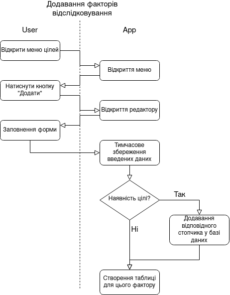
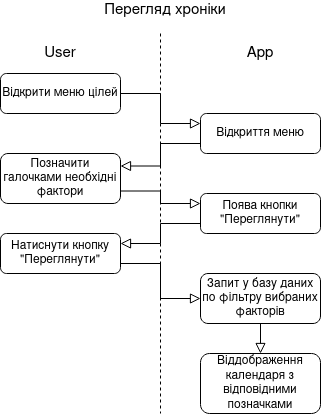
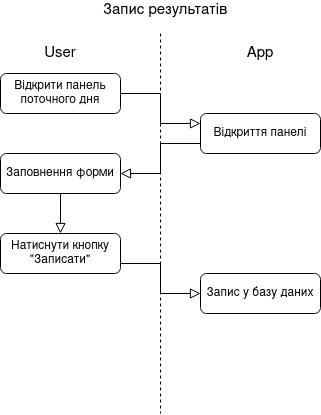
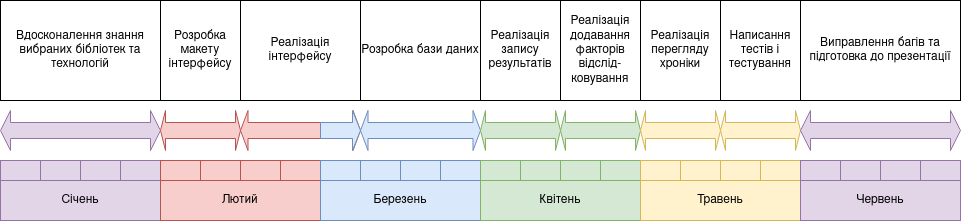

# Watcher
## Опис проекту
Проект є кросплатформним додатком, який допоможе користувачу відслідковувати зміни на протязі тривалого терміну у вигляді постановки цілей або факторів відстежування та створення спеціальних відміток у календарі. 
## Актуальність
### Затребуваність
Наразі існує велика кількість додатків, як мобільних так і будь-яких інших, які допомагають відслідковувати певний специфічний ряд дій. Наприклад, так звані "трекери звичок", де користувач ставить ціль і щодня відмічає про виконання и невиконання задуманого. Також схожими за функціоналом є "менструальні календарі", де надається можливість заповнення вбудованих полів. Існують "відслідковувачі здоров'я", котрі пропонують записувати медичні показники такі як тиск, температура, тощо та контролювати курс прийому лікарських препаратів. Менш схожими, але все ж вартими уваги є "калькулятори калорій" з можливістю записувати щодня вагу, параметри тіла та калорійність спожитих продуктів.
### Ціль проекту
Проект має на меті об'єднати можливості всього вищезгаданого. Це може бути зроблене за допомогою надання користувачу можливості створення декількох варіантів факторів для віслідковування. Наприклад, один тип числового поля для запису показників, що не мають мінімальну кількість для позитивного результату (наприклад, температура), інший тип числового поля для запису прогресу виконання, що буде мати попередньо створену ціль (наприклад, пройдено 6130 кроків з 10 000), бінарний тип для позначення факторів, що не залежать від кількості: позначка так/ні(наприклад, полити квіти), тестове поле для запису суб'єктивних показників, що не можуть бути описаними чисельно чи у будь-який інший спосіб (наприклад, самопочуття чи настрій).   
Усі функції є необхідними для певної групи людей, а їх об'єднання робить проект дуже універсальним, а отже актуальним для багатьох сфер життя і різних категорій суспільства.
## Функціонал продукту
Продукт надає можливість спершу налаштувати особисту специфіку користувача, а саме додати цілі, обрати типи полів та їх назви для відслідковування визначених факторів. Після цього кожного дня надається можливість запису показів згідно обраного. Опираючись на введену інформацію, продукт надає користувачеві статистику, що може бути налаштована. Вона є віддображенням у календарі прогресу чи інших специфік відміток, що були створені на протязі останнього місяця. Її налаштування відбувається шляхом вибору полів, що будуть показані, так є можливість побачити записи відповідно до одного чи всіх критеріїв. При переході до певного дня відображається уся записана інформація за цю дату, що надає можливість перегляду як загального бачення відстежуваної інформації так і її детального хронологічного розгляду. Впродовж усього використання користувач має змогу змінити, відредагувати чи додати нові поля для нових чи вже наявних факторів.

Наявні такі типи: один тип числового поля для запису показників, що не мають мінімальну кількість для позитивного результату (наприклад, температура), інший тип числового поля для запису прогресу виконання, що буде мати попередньо створену ціль (наприклад, пройдено 6130 кроків з 10 000), бінарний тип для позначення факторів, що не залежать від кількості: позначка так/ні (наприклад, полити квіти), тестове поле для запису суб'єктивних показників, що не можуть бути описаними чисельно чи у будь-який інший спосіб (наприклад, самопочуття чи настрій).   
## Вибір стеку технологій
Оскільки одним із основних характеристик додатка, що дозволяє робити будь-які записи є зручність та доступність, то важливим є саме можливість ним скористатися у будь-який час та у будь-якому місці. З цього випливає, що додаток повинен бути або мобільним (у більшості користувачів є легкий доступ до смартфону), або ще краще ***кросплатформним***.
Також є важливим вибір технології розробки. Спочатку необхідно визначитися із тим буде додаток нативний чи гібридний. Розглянемо обидва випадки.
### Гібридні додатки
Це універсальні додатки, які створені для багатьох платформ одразу і мають аналогічну функціональність незалежно від самої платформи. Можна сказати, що гібридний додаток – це по суті веб-сайт у звичному форматі мобільного додатку.
#### Переваги
+ Універсальність. Гібридні додатки створюються для декількох платформ одразу, після чого відносно просто адаптуються під кожну. Це може включати не тільки версії для iOS та Android, а також веб- та десктопні версії. Завдяки цьому, гібридні додатки доступні значно більшій аудиторії користувачів.

+ Менша вартість розробки. Такий тип додатків простіший та швидший у розробці, тому їх початкова собівартість нижча, ніж у нативних програм. Це робить гібридні додатки привабливим рішенням для компаній, що мають обмежений стартовий бюджет.

+ Швидший вихід на ринок. Простіша розробка гібридних додатків надає ще одну перевагу – менший термін розробки, що дозволяє відносно швидко випустити продукт і отримати перший прибуток. Якщо компанія не має можливості витрачати багато часу на розробку, то такий тип додатків є розумним рішенням.

#### Недоліки

Як правило, гібридні додатки працюють з затримкою і певними обмеженнями. А також, має менш user-friendly інтерфейс і при використанні більше багів.
### Нативні додатки
Це додатки, розроблені для конкретної платформи, з урахуванням специфіки даної платформи та доступом до всіх її ресурсів.
#### Переваги
+ Просте опанування. Інтерфейс та графічна складова нативних додатків наслідують ідеолонію дизайну, закладену у конкретну операційну систему. Положення елементів керування, кольорова палітра, анімація – все це сприймається природним. Тому освоїти такий додаток дуже просто, а його використання не буде викликати дисонансу з вже існуючим досвідом користувача.

+ Висока швидкість роботи. Нативні додатки оптимізовано під певну мобільну ОС, за рахунок чого вони працюють швидко і надзвичайно стабільно. Окрім того, дані таких додатків зберігаються переважно на пристрої, що також підвищує швидкість їх роботи та зменшує залежність від Інтернету.

+ Широкі можливості. Такий тип додатків має доступ до всіх можливостей ОС та компонентів пристрою: GPS, камери, календаря, адресної книги та іншого. Завдяки цьому, нативні додатки мають широку функціональність та легко інтегруються між собою.

#### Недоліки
Собівартість таких додатків є набагато вищою, й існує необхідність окремої розробки під кожну платформу.

---
Таким чином у кожного типу є свої плюси та мінуси, проте є можливість за допомогою вибору фреймворку нейтралізувати негативні особливості нативних додатків. Тому було вирішено розробляти ***нативний*** додаток.
### Мова програмування та фреймворки
**Python** — стабільна та поширена мова. Вона використовується в багатьох проєктах та в різних якостях: як основна мова програмування або для створення розширень та інтеграції додатків. На Python реалізована велика кількість проєктів, також вона активно використовується для створення прототипів майбутніх програм. Інтерпретатор Python реалізований практично на всіх платформах та операційних системах. Наявна велика кількість модулів, що підключаються до програми та забезпечують різноманітні додаткові можливості.

Враховуючи мову програмування існує два фреймворки для реалізації кросплатформного додатку. Це Kivy і BeeWare. Ключова відмінність між Kivy і BeeWare в тому, що BeeWare використовує нативний набір інструментів UI для певної платформи. Kivy використовує кастомний набір інструментів UI, який задіює ті ж елементи управління на всіх платформах. Це означає те, що додаток на певній платформі не буде виглядати як додаток для цієї платформи.
У BeeWare UI контролерами будуть кнопки, чекбокси і інші формені елементи, що надаються системою, під яку розроблено додаток. Це означає, що ви можете створювати додатки, які виглядають і відчуваються стовідсотково нативними для кожної мобільної і десктоп платформи. Тому вибір зупиняється на останньому.
### База даних
Переваги SQLite:

- доступність на всіх платформах
- легкість та переносимість, оскільки вся база даних знаходиться у одному файлі
- база даних є локальною, тобто доступ до неї, а отже і робота додатку можлива без підключення до будь-якої мережі

## Стек технологій

- BeeWare — фреймфорк для написання кросплатформних додатків з графічним інтерфейсом
- Python — інтерпретована об'єктно-орієнтована мова програмування високого рівня зі строгою динамічною типізацією. 
- SQLite — це бібліотека, яка реалізує невеликий, швидкий, автономний, високонадійний, повнофункціональний механізм баз даних SQL.

## Дії користувачів

## Порівняння з конкурентами
- Habit from Roman K.
- Period Tracker from Amila
- MedM Helth from MedM Inc.

*Критерії* | Watcher | Habit | Period Tracker | MedM Helth
--- | --- | --- | --- | --- | 
Створювання цілей | + | + | - | - |
Задавання терміну цілей | + | - | - | - |
Різні типи позначок | + | - | + | + |
Перегляд результатів у вигляді календаря | + | - | + | - |
Допомога у створенні нових звичок | + | + | - | - |
Допомога у відслідковуванні місячного циклу | + | - | + | - |
Допомога у відслідковуванні показників здоров'я | + | - | - | +
Комплексний перегляд результатів різних показників | + | + | + | -
Додавання нотаток (текстові фактори) | + | - | + | + |
Додавання числових позначок | + | - | - | +
Додавання позначок так/ні | + | + | + | -

## План виконання

